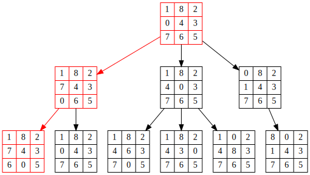

# 8Puzzle
Classic 8 Puzzle problem solved using blind search algo dfs &amp; bfs with visualization.

### Example

```python

start_state = [
    [1, 8, 2], 
    [0, 4, 3], 
    [7, 6, 5]
]

end_state = [
    [1, 8, 2],
    [7, 4, 3],
    [6, 0, 5]
]

```


